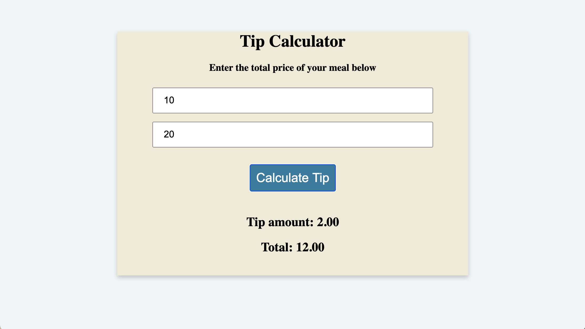

# 🐛 Submit Button on Form Refreshes Page

Work with a partner to resolve the following issues:

* Users should be able to see the calculated tip amount and total on the screen after clicking on the submit button. 

## Expected Behavior

When a user enters numbers in the text fields and clicks on the Calculate Tip button, calculated totals for both the tip amount and total should appear on screen.  

## Actual Behavior

When a user clicks on the Calculate Tip button, the page refreshes without updating content on the screen.

## Assets

The following image demonstrates the web application's appearance and functionality:

---
## 💡 Hints

What action may be preventing the calculated totals from being rendered correctly on the page? How can we cancel that action?

## 🏆 Bonus

If you have completed this activity, work through the following challenge with your partner to further your knowledge:

* Even when an event is canceled, it continues to propagate. What does that mean? 

Use [Google](https://www.google.com) or another search engine to research this.

---
© 2023 edX Boot Camps LLC. Confidential and Proprietary. All Rights Reserved.
