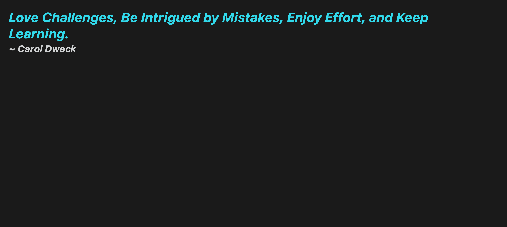

# 📖 Create HTML Elements with jQuery

Work with a partner to implement the following user story:

* As a user, I want to be greeted with a quote by an author when I open the page.

## Acceptance Criteria

* It's done when the page dynamically displays a quote by an author and the author's name on load.

## 📝 Notes

Refer to the following documentation: 

[jQuery API Docs](https://api.jquery.com/)

## Assets

The following image demonstrates the web application's appearance and functionality:

  

---

## 💡 Hints

* Don’t forget to add jQuery to `index.html` before you begin.

* Only use jQuery methods! Do **NOT** use any of the following vanilla JavaScript methods: `createElement`, `textContent`, or `appendChild`.

## 🏆 Bonus

If you have completed the activity and want to further your knowledge, work through the following challenge with your partner:
  
* How can we add event listeners using jQuery? Use [Google](https://www.google.com) or another search engine to answer this question.

---

© 2023 edX Boot Camps LLC. Confidential and Proprietary. All Rights Reserved.
