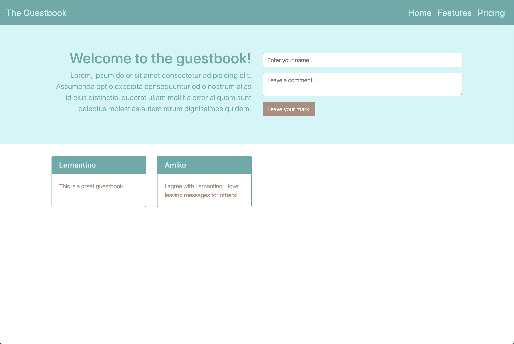

# 🏗 Add Custom Styles to the Page 

Work with a partner to implement the following user story:

* As a user, I want to visit a site that uses a custom color theme and branding.

## Acceptance Criteria

* It's done when the page is not utilizing the generic colors provided by Bootstrap.

## Assets

The following image demonstrates the web application's appearance and functionality:

---

## 💡 Hints

* There is a color theme already available to use in `style.css`, but feel free to use [Adobe Color](https://color.adobe.com/).

* Don't forget to use the previous example as a guide to how custom styles can be applied with CSS.

## 🏆 Bonus

If you have completed the activity and want to further your knowledge, work through the following challenge with your partner: 

* What are some other UI frameworks that we could use? To get started, try [Bulma](https://bulma.io/), [Materialize](https://materializecss.com/), and a very customizable one called [Tailwind](https://tailwindcss.com/).

---

© 2023 edX Boot Camps LLC. Confidential and Proprietary. All Rights Reserved.
