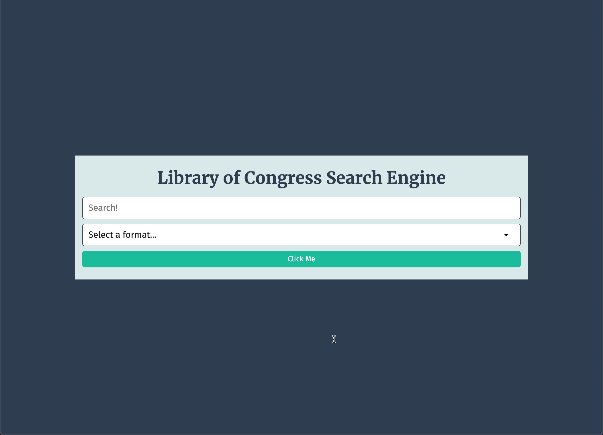

# Module 06 Mini-Project: Library of Congress Search Tool

In this activity, you will work with a group to build an application that searches and displays results from the Library of Congress API.

## Instructions

The completed application should meet the following criteria:

* As a user, I can submit a search query from the application to request data and receive a response from the Library of Congress.

* As a user, I can either perform a generic search for data in all formats or I can select a format in the form to help filter results.

* As a user, I can see all of the results of my search displayed on a separate page.

* As a user, I can conduct additional searches from the results page as well.

To learn about how to use this API, check out the Requests section of the [Library of Congress API documentation](https://www.loc.gov/apis/json-and-yaml/requests/).

### The Homepage

The homepage (`index.html`) should have the following:

* A simple, well thought-out UI.

* A form with a text input field to capture a search query and an option select dropdown to capture the format of the search query. The options in the dropdown should be a list of the possible format values listed in the [Library of Congress API documentation on requests](https://www.loc.gov/apis/json-and-yaml/requests/endpoints/).

* A browser event listener attached to the form to execute a function on submission, which will capture both form values and redirect the user to a search results page with those values included in the URL as query parameters. This will use the browser's `location.assign()` method.

* If there is no format selected from the dropdown, the URL should look something like the following example:

  ```http
  /search-results.html?q=dogs&format=
  ```

* If there is a format selected from the dropdown, the URL should look something like the following example:

  ```http
  /search-results.html?q=dogs&format=photos
  ```

### The Search Results Page

The search results page (`search-results.html`) should have and do the following:

* On page load, if there are query parameters, immediately parse them and use them in a request URL to fetch data from the Library of Congress API.

* If there is a value for the format query parameter, use the format endpoint to search for something based on the chosen format. For more information, see the "format" section of the [Library of Congress API documentation on the format endpoint](https://www.loc.gov/apis/json-and-yaml/requests/endpoints).

* If there is no value for the format query parameter, use the search endpoint to search for all types of data. For more information, see the "search" section of the [Library of Congress API documentation on the search endpoint](https://www.loc.gov/apis/json-and-yaml/requests/endpoints/).

* The response from the API request will then be displayed on the page. It is up to you and your team to determine which data should be displayed from the overall `response` object, but you must use data from the `results` property in the `response` object. For more information, see the [Library of Congress API documentation on responses](https://www.loc.gov/apis/json-and-yaml/responses/search-results/).

* The same form from the homepage should be here as well. Instead of redirecting a user to another page, however, it will perform a search right on the page and display the new results.

## Assets

The following image demonstrates the homepage's appearance and functionality:



The following image demonstrates the search results page's appearance and functionality:


---

## 💡 Hints

Will every result have the same data? If not, how will we handle printing it to the page? Can the form design and functionality from the homepage be reused for the search results page?

## 🏆 Bonus

* How can we build this application using our knowledge in Git collaboration?

---
© 2023 edX Boot Camps LLC. Confidential and Proprietary. All Rights Reserved.
