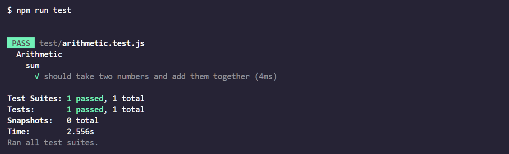

# 🐛 Unable to Run Tests

Work with a partner to resolve the following issue(s):

* As a developer, I want to run my unit tests so that I can have confidence that my code works.

## Expected Behavior

When I execute `npm run test` on the command line, my unit test runs and output is displayed in the command line.

## Actual Behavior

When I execute `npm run test` on the command line, an error is printed.

## Steps to Reproduce the Problem

1. Open the terminal and switch to the `Unsolved` folder for this activity.

2. Run `npm run test`.

## Assets

The following image demonstrates the web application's appearance and functionality:

---

## 💡 Hints

* How can npm run scripts be added to the `package.json` file?

* How can development dependencies be added using npm?

## 🏆 Bonus

If you have completed this activity, work through the following challenge with your partner to further your knowledge:

* How are ATDD and BDD similar to or different from TDD?

Use [Google](https://www.google.com) or another search engine to research this.

---
© 2024 edX Boot Camps LLC. Confidential and Proprietary. All Rights Reserved.
