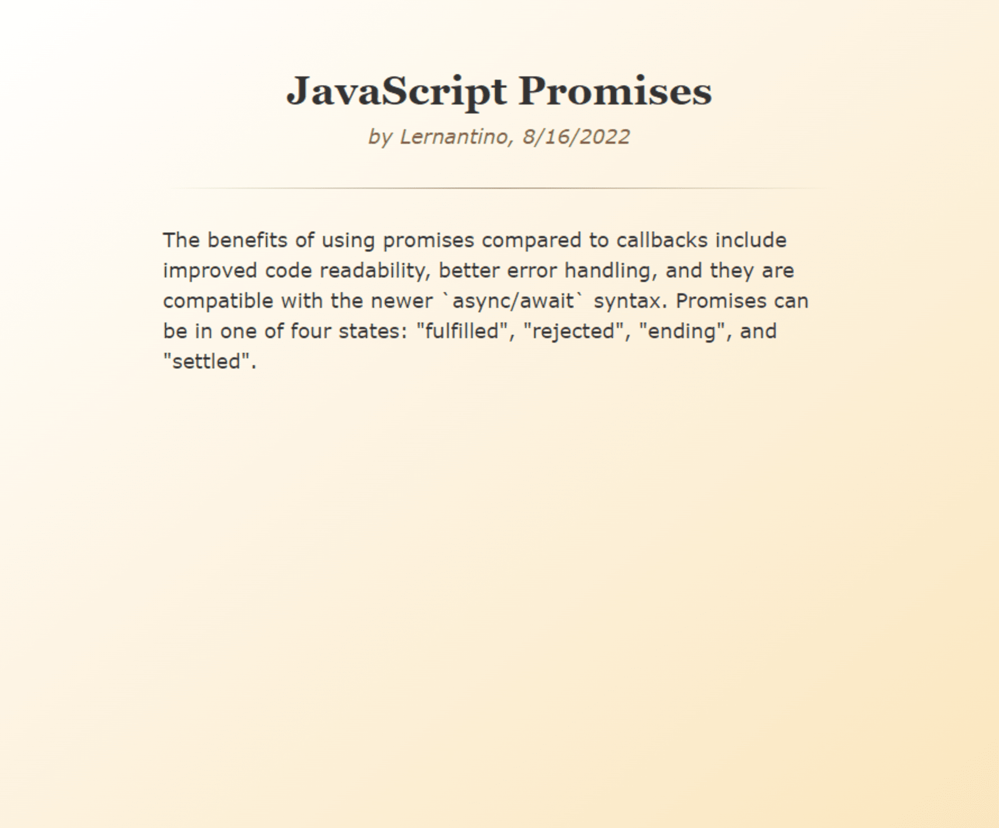

# 🏗️ Generate Blog Post HTML using JSON data

Work with a partner to implement the following user story:

* As a developer, I want a utility that can read data from a json file and generate an html document for a blog post, so that I can update the html more efficiently.

## Acceptance Criteria

* It's done when data is asynchronously read from blogPost.json.

* It's done when an html string is generated using the `render()` method of the `BlogPost` class.

* It's done when an html document is written to post.html.

* It's done when a message is printed to the terminal after the html file is created successfully.

## Assets

The following image demonstrates the web application's appearance and functionality:

---

## 💡 Hints

* How can promises be used to perform multiple asynchronous tasks in a sequence?

* How can the built-in `fs/promises` Node module be used to read and write files asynchronously?

## 🏆 Bonus

If you have completed this activity, work through the following challenge with your partner to further your knowledge:

* What does the `Promise.all()` method do?

Use [Google](https://www.google.com) or another search engine to research this.

---
© 2024 edX Boot Camps LLC. Confidential and Proprietary. All Rights Reserved.
