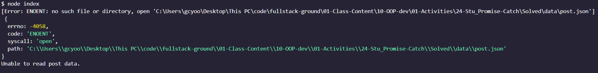

# 📖 Handle Exceptions in Promises

Work with a partner to implement the following user story:

* As a developer, I want to debug and handle errors when they occur in a promise, so that I can debug my code more efficiently.

## Acceptance Criteria

* It's done when the exception within the asynchronous code is caught and logged in the terminal.

* It's done when I see `Unable to read post data` printed in the terminal.

## 📝 Notes

Refer to the documentation:

[MDN web docs on .catch()](https://developer.mozilla.org/en-US/docs/Web/JavaScript/Reference/Global_Objects/Promise/catch)

## Assets

The following image demonstrates the web application's appearance and functionality:

---

## 💡 Hints

* With multiple calls to `.then()` in a chain, how can you write one function to handle an error in any of the `.then()` calls in the chain?

## 🏆 Bonus

If you have completed this activity, work through the following challenge with your partner to further your knowledge:

* What does the Node `promisfy` utility do?

Use [Google](https://www.google.com) or another search engine to research this.

---
© 2024 edX Boot Camps LLC. Confidential and Proprietary. All Rights Reserved.
