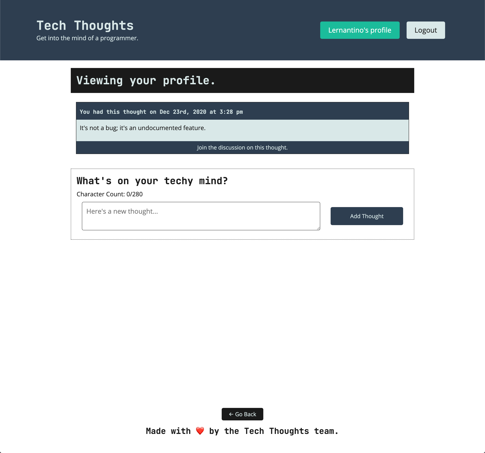

# 🐛 Profile Page isn't Displaying the Logged in User's Data

Work with a partner to resolve the following issue(s):

* As an authenticated user, I want my username to display on the profile link in the header.

* As a user, I want to see my own thoughts when I visit the profile page.

* As a user, I want to enter my thoughts and comments into the appropriate forms, and have my submitted data appear on the page.

## Acceptance Criteria

* It is done when an authenticated user can see a link in the header which reflects their username.

* It is done when an authenticated user can navigate to the `/me` route and see their post history.

* It is done when a user can see their newly submitted thoughts display on the page.

* It is done when a user can see their newly submitted comments display on the page.

## Steps to Setup

1. Navigate to `18-Stu_JWT-Review/Unsolved` from the command line.

2. Run `npm install`, `npm run seed`, and `npm run develop`.

3. Open <localhost:3000/login> in the browser.

4. Log in with the following test credentials, or create your own user and some thoughts:

    ```json
    {
      "email": "lernantino@techfriends.dev",
      "password": "password10"
    }
    ```

## Assets

The following image demonstrates the profile page's appearance and functionality:



---

## 💡 Hints

* What tool can we use to debug the encoded payload within the JWT token?

* Which entity in the JWT token cycle is responsible for signing and verifying the integrity of the token?

## 🏆 Bonus

If you have completed this activity, work through the following challenge with your partner to further your knowledge:

* How could we implement authentication in a React app without using GraphQL?

Use [Google](https://www.google.com) or another search engine to research this.

---
© 2024 edX Boot Camps LLC. Confidential and Proprietary. All Rights Reserved.
